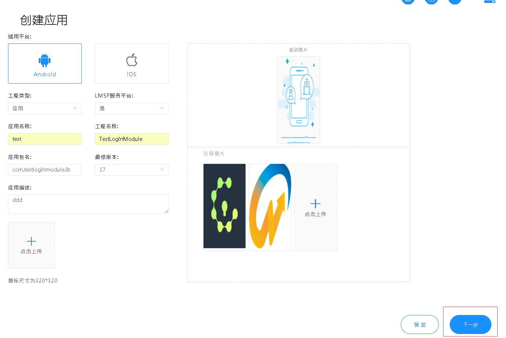

## 使用说明

EagleWelcome主要包含两个功能，进入app时的logo展示以及guide界面展示
该模块主要用来在[凌志移动平台](http://192.168.32.37:8082/dist/#/app/list)上创建app的时候展示引导页使用

相关界面实现类主要有两个

- WelcomeActivity:  入口类
- EagleWelcomeNativeModule:   界面展示内容类

本模块主要作为app的入口类使用

```xml
 <activity android:name=".WelcomeActivity" 
           android:theme="@style/Theme.AppCompat.Light.NoActionBar">
     <intent-filter>
       <action android:name="android.intent.action.MAIN"/>
       <category android:name="android.intent.category.LAUNCHER"/>
     </intent-filter>
 </activity>
``` 

## 平台使用EagleWelcome

首先在`凌志移动平台`上创建应用,界面如下

1.点击启动图片下的点击上传即可设置启动图片


2.点击引导图片下的点击上传即可设置引导图片，可以设置任意数量的引导图片


3.设置完成后点击下一步


4.然后在添加模块的业务模块中选择`EagleWelcome`,按照提示创建即可

 
 
## 直接使用

不经过平台创建应用要使用该模块,先应用该模块

```groovy
implementation 'com.linkstec.common.eaglewelcome:EagleWelcome:1.0.1
```

然后在工程的main文件夹下面创建assets文件夹，在assets文件夹下面创建splashImg文件夹和welcomeImg文件夹

然后将要在app打开时展示的图片放入splashImg文件夹下，路径如下
`main/assets/splashImg/splash.png`

!>展示图片名必须是splash.png 否则无法展示

引导页图片放入welcomeImg文件夹下，可以放入多张图片，图片名自命名
`main/assets/welcomeImg/xxx`

这样引导页就配置完成了~
